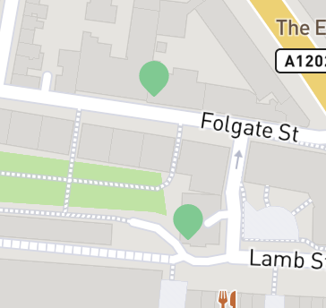
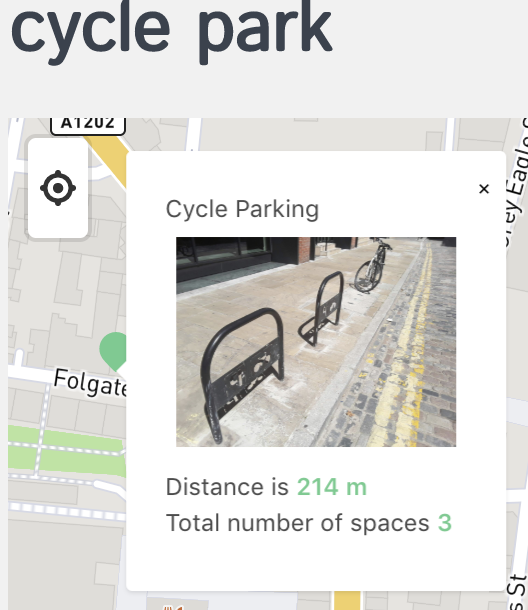
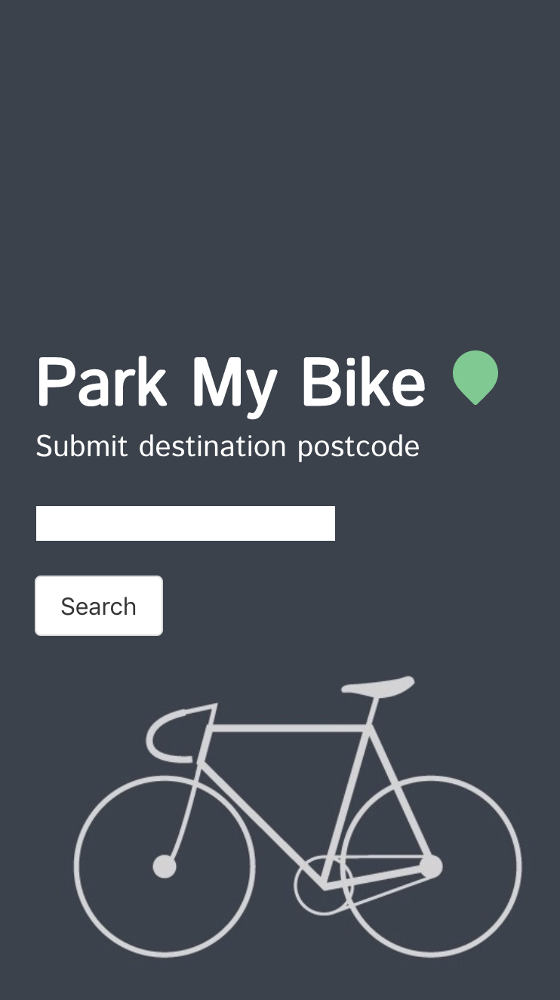
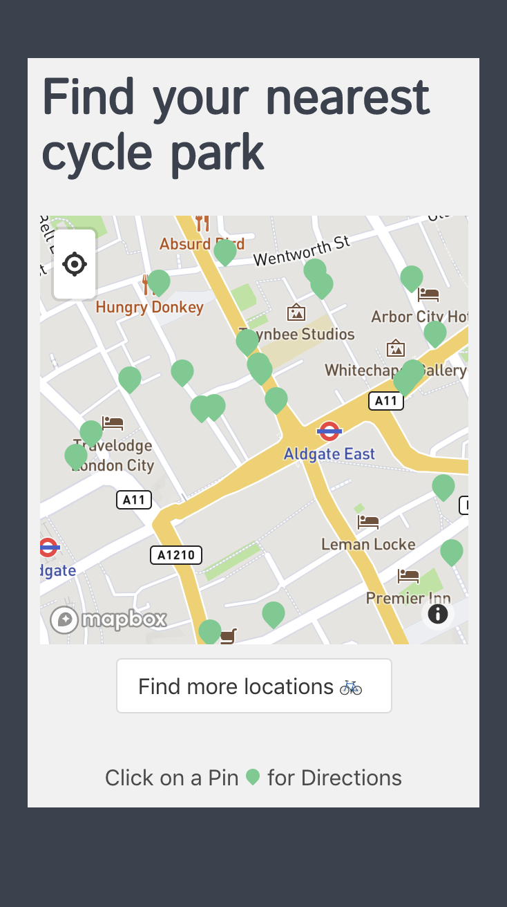

# Project-2-Park-My-Bike

## Overview

This project was the result of a 48-hour paired hackathon challenge in which we were instructed to create an app that utilised one or more restful APIs.

@jonnysfarmer and I worked on this project. As we both wanted the challenge of working with resources we hadn’t used up until this point, we decided a map-based app would be a great foundation. 

Together we created 'Park My Bike', an app that allows the user to locate parking space for their bicycle.

This made up my second project of the General Assembly Software Engineering Immersive program.

##Technologies Used
####Core

* HTML5
* CSS3
* Javascript (ES6)
* React.js

####Additional Libraries

* Bulma
* Mapbox
* Axios

####Bundler

*  webpack

#### External APIs

* Postcodes.io
* Tfl.co.uk

## Instructions

Once on the landing page, type the postcode of your destination and hit 'Search'. A map will then load displaying the cycle parking spots in the area of the entered postcode.

One can click on the options that appear to see more information such as the number of spots available, an image of the facility and distance from the central point of the given postcode.

If you'd like to move to another point on the map and investigate further, simply move the map and hit the refresh button ('Find more locations') to get more parking locations.

Once a particular parking location is selected, a starting location can be entered. This will then return directions in step by step format to the destination.

If there's a change of mind, a new location can be selected and the directions will be updated. If the  starting location needs to be updated there is also an option to do so ('Change starting location').

## Methodology

The app has two main displays:

1.	The landing page which enables the user to direct where the first view of information will be displayed.
2.	The map area where data can be viewed, updated and changed.

### The Process

We began by brainstorming ideas. We used Mapbox for our map component and through some research found a library  to ease some of the map work involved with React compatibility (Reactmap GL). 

We knew in order to have a good product and an efficient process we would need a good API. We quickly settled on an idea centred on bicycle parking areas inspired by my own daily bicycle commute.

We investigated the end points that the TfL website provided, looking at the specifics of the data that was provided and the size. We found a few elements that gave direction to the app development.

1.	The data size was large and if the searches on the end points were wide enough, the browser would hang and timeout before a response was given.
2.	The API provided directions by way of cycling specifics. For example, if a cycle difficulty was provided a route could be generated between two points.
3.	The API returned data on the basis of latitude and longitude.

With regards to the last point, we knew that from a usability point of view, latitude and longitude would not be something the average user would work with. Therefore, a postcode API was added to our list of resources.

While our initial research work in terms of additional features, styling and usability was conducted with regular communication and on separate computers the bulk of the app’s creation was done in a pair programming format with @jonnysfarmer as the driver and I as the navigator.

## Features

The initial input is checked through an ‘onchange’ function that eliminates any whitespace usage by replacing it with a no characters. This enables us to avoid errors through different formats of postcode entry.

Once the postcode is entered it is sent to the postcode API. If the postcode is correct it pushes the returned longitude and latitude through the router and enables us to establish the initial viewport for the map view.

When the data is received from the TfL API, this data is plotted onto the map area. Through the usage of Mapbox markers and popup examples, the functionality to hide and display information on each location is rendered on every call, either through new start and end information or through the 'refresh' button. Take a look at the snippets below for functionality:

Mapbox markers



Mapbox popups



Main Screens

	


### Code Snippets

The first view is set by bringing through information  through the router.

```

handleSubmit(e) {
    e.preventDefault()
    axios.get(`http://api.postcodes.io/postcodes/${this.state.postcode}`)
      .then(resp => {
        console.log(resp)
        this.setState({
          export: {
            longitude: resp.data.result.longitude,
            latitude: resp.data.result.latitude
          }
        })
        this.props.history.push(`/map/${this.state.export.latitude}/${this.state.export.longitude}`)
      })
      .catch(() => this.setState({ errors: 'Invalid Postcode' }))

  }


```

Once the required data was received we mapped the data by coordinates using a marker element and an svg:

```
loadBikeParks = () => {
    return this.state.bikedata.places.map((ele, i) => {
      return (
        <Marker
          key={i}
          latitude={ele.lat}
          longitude={ele.lon}
        >
          <Pin size={20} onClick={() => this.setState({ showPopup: ele })} />
        </Marker>
      )
    })
  }
  
```


## Challenges

A major challenge was the time pressure and understanding what can be done in the time frame. A second element was using the new information we had just learned and working with a partner under such pressure. In the end, we were able to deliver a solid product by focusing on the core deliverable and branching out from the single computer working style for reasearch purposes.


